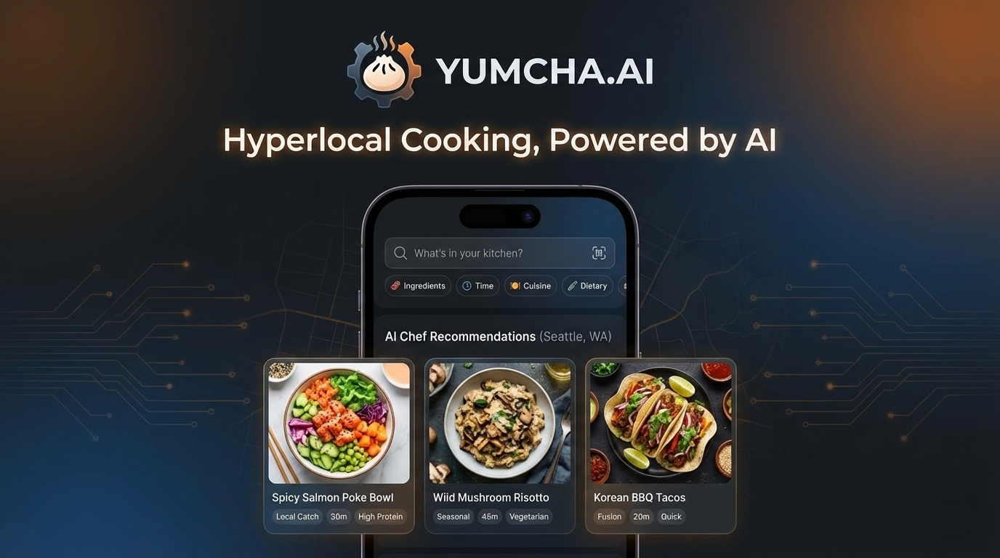

<div align="center">
  
  <h1>YumCha.ai</h1>
  <p><strong>Hyperlocal, AI-powered cooking assistant that curates personalized recipes, simplifies meal prep, and brings regional flavors to your fingertips.</strong></p>
  
  <p>
    
    
    
  </p>
</div>

---

[**Try YumCha.ai Live**](https://yumcha-ai-qle1.onrender.com/)
[**Alternate Link (vercel)**](https://yumcha-ai.vercel.app/)

---

## 🧑‍🍳 Meet your Maharaj
**YumCha.ai** isn't just a recipe generator; it's a digital Indian kitchen expert. Whether you're a hostel student with just a kettle, an office-goer in a rush, or a home cook looking for that authentic regional touch, the **Maharaj** has got you covered.

### ✨ Key Features
- **📸 Smart Ingredient detection**: Upload an image of your fridge or pantry, and let the AI tell you what's possible.
- **🍛 Hyperlocal Knowledge**: From Punjabi Tadka to South Indian Sambar, request recipes from specific regions.
- **🛠️ The "Jugaad" Mode**: Missing an ingredient? Enable *Jugaad* to get creative Indian substitutes.
- **🇮🇳 Hinglish Toggle**: Switch between pure English or the classic *Hinglish* (Hindi + English) vibe for that real kitchen feel.
- **🥄 Local Measurements**: Switch from grams/ml to *Katori, Pinch, Glass, and Spoon*.
- **💎 Premium UI**: A sleek, dark glassmorphism interface with liquid-glass effects and smooth animations.

---

## 🛠️ Tech Stack
- **Frontend**: HTML5, Vanilla CSS (Premium Glassmorphism), JavaScript (ES6+).
- **Backend**: Node.js, Express.
- **AI Engine**: Google Gemini 2.5 Flash (via `@google/generative-ai`).
- **Styling**: Google Fonts (Outfit), Font Awesome.
- **Deployment**: Optimized for **Vercel** and **Render.com**.

---

## 🚀 Getting Started

### Prerequisites
- Node.js (v18+)
- A Google Gemini API Key (Get it from [Google AI Studio](https://aistudio.google.com/))

### Installation
1. **Clone the Repo**:
   ```bash
   git clone https://github.com/G-Abhinav01/YumCha.ai.git
   cd YumCha.ai
   ```
2. **Install Dependencies**:
   ```bash
   npm install
   ```
3. **Configure Environment**:
   Create a `.env` file in the root directory:
   ```env
   API_KEY=your_gemini_api_key_here
   PORT=3000
   ```
4. **Run Locally**:
   ```bash
   npm start
   ```
   Visit `http://localhost:3000` and start cooking!

---

## 🌍 Deployment

### Vercel
This project is pre-configured with `vercel.json`. Simply import the repository to Vercel and add your `API_KEY` in the project environment variables.

### Render.com
Works out of the box. Use `npm start` as the start command and add your environment variables in the Render dashboard.

---

### ⚠️ Licensing Notice

This project is licensed under the **Creative Commons BY-NC-ND 4.0** license.

- ✅ You’re free to explore, read, and share this code for learning or evaluation.
- ❌ Commercial use or redistribution of modified versions is not allowed.

I retain full rights over this code and project. For the full legal terms, please see the [LICENSE](LICENSE) file.

For **collaborations, licensing, or business inquiries**, feel free to reach out via [email](mailto:abhinav.achiver01@gmail.com) or [LinkedIn](https://linkedin.com/in/g-abhinav-138a39252).

---
<div align="center">
  Made with ❤️ for Indian Foodies
</div>
